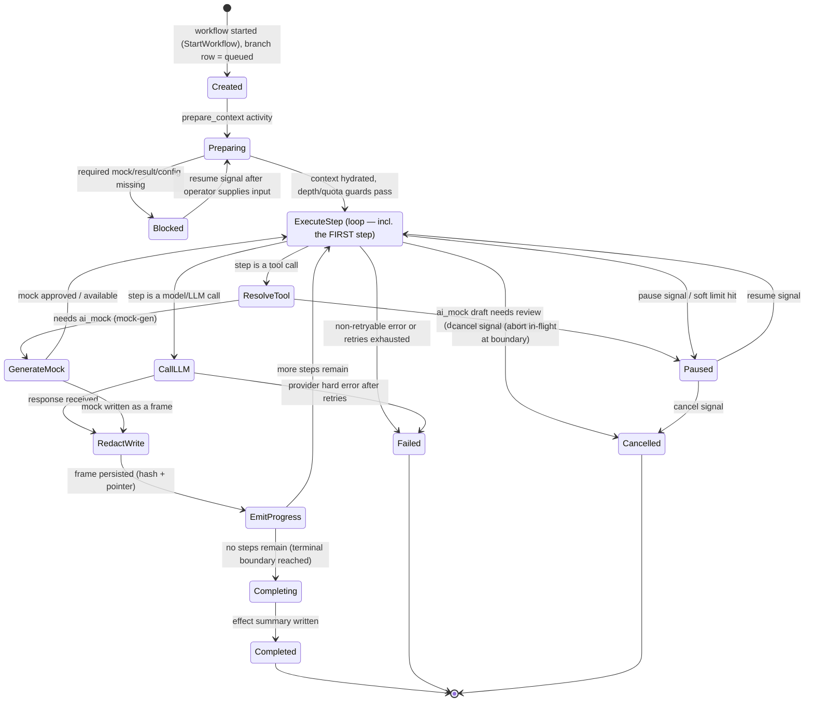

# Temporal Workflow Lifecycle — the Branch/Replay Loop

How ForkReplay orchestrates a fork/replay branch as a **Temporal** workflow plus a set of
Temporal activities, when you run it on your own infrastructure. This is the orchestration
design contract for the durable branch loop; the worker code that implements it lives in
`services/replay-worker`, `services/mock-gen-worker`, and `services/export-worker` and is
authored in a later implementation phase.

> **This design replaces the deprecated Cloudflare Workflows path.** Durable orchestration
> moved off Cloudflare Workflows (the legacy `step.do` / `waitForEvent` model under
> `workflows/cloudflare`) to self-hosted **Temporal** in the OSS self-host pivot. Temporal is
> the only orchestrator in V1; there is no first-call bypass and no managed-SaaS variant.

Grounding: `implementation-readiness-spec.md` §"Durable Orchestration" + the `Branch` state
machine; `agent-trace-fork-prd.md` §"Operator quotas (`WorkspaceLimits`)". Read
`docs/deployment/architecture.md` first for how Temporal, Redis, and the FastAPI SSE
endpoint sit in the overall topology.

---

## 1. The branch/replay workflow state machine

A single fork/replay is one Temporal workflow execution: `BranchReplayWorkflow`. The workflow
**owns lifecycle progression, long waits (Temporal timers), pause/resume (signals),
cancellation, and repeated-trial fan-out (child workflows)**. It orchestrates **every** branch
step **including the first** model call — there is no first-call bypass; the fork-start latency
budget assumes worker/workflow bootstrap is on the critical path (mitigated by a pre-warmed
worker pool and, optionally, a workflow started speculatively on fork-editor open that awaits a
`user_confirmed_run` signal).

The workflow status mirrors the canonical `Branch.status` enum
(`draft → estimating → blocked → queued → running → paused → completed | failed | cancelled`)
so the control-plane Postgres row and the Temporal execution never disagree.

### 1.1 Lifecycle diagram

### 1.2 Transitions, described

- **create** — `services/api` validates the intervention manifest, writes the `Branch` row as
  `queued`, and calls `StartWorkflow` with a deterministic workflow ID
  (`branch:{workspace_id}:{branch_id}`). Starting with a fixed ID makes "start" idempotent: a
  retried API request reattaches to the running execution instead of forking a duplicate.
- **prepare** — `prepare_context` hydrates the original frame stream up to the fork point,
  splices in the user's edit, validates the resolved model/parameters against the configured
  LLM backend, and checks `WorkspaceLimits` guards (concurrency slot, branch depth, token
  pre-flight). On a missing mock/result/config it transitions to **blocked**.
- **execute step(s)** — the workflow loops over branch steps. **The first step runs inside the
  same loop as every later step** (no special-casing the first model call). Each iteration is a
  workflow *decision* about what the next step is; the actual work is delegated to an activity.
- **mock-gen / LLM call** — per the V1 tool-resolution order (forced result → approved mock →
  approved ai_mock → generate-ai_mock-draft-and-pause → block), a tool step resolves via
  `resolve_tool` and, when an ai_mock draft is needed, the `generate_mock` activity (run on the
  mock-gen worker pool). A model step calls the configured LLM provider via `call_llm`. The
  executor **never** calls a live tool in V1.
- **redact/write** — `redact_and_write` applies the workspace redaction policy and writes the
  resulting frame to the object store (content-addressed) and the control-plane step row,
  returning only `{frame_hash, pointer_id}` so Temporal history stays compact.
- **progress emit** — `emit_progress` appends a `branch_event` row and publishes it to Redis
  (see §5) so the workbench sees live progress.
- **complete** — when no steps remain, the workflow runs the effect-summary activity and marks
  the branch `completed`.
- **fail** — a non-retryable activity failure (or a retryable one whose retries are exhausted)
  transitions to `failed`; the workflow records `workflow.dead_letter` for the operator.
- **cancel** — a `cancel` signal aborts the in-flight model call at the next deterministic
  boundary and marks the branch `cancelled` (see §3 and the Cancellation Contract).
- **pause/resume** — `pause` parks the workflow at a deterministic boundary (Temporal timer /
  `workflow.wait_condition`); `resume` continues it. Missing-input and ai_mock-review pauses use
  the same machinery.

---

## 2. Activities — boundaries, idempotency, and retry

**Workflow code is deterministic and side-effect-free**: it decides *which* step is next, reads
signals/queries, starts timers, and enforces guard conditions. **All I/O is a side-effecting
activity** — provider calls, mock generation, object-store / Postgres / ClickHouse writes, and
Redis publishes. Activities return small values (hashes, pointer IDs, counters), never frame
payloads, to keep workflow history small and replayable.

| Activity | Worker pool (task queue) | Side effects | Idempotency key | Retry policy |
|----------|--------------------------|--------------|-----------------|--------------|
| `prepare_context` | replay-worker | reads frames, writes prepared-context pointer | `branch_id` | retryable; bounded by `workflow_step_retries`, 5s initial delay, exponential backoff |
| `resolve_tool` | replay-worker | pure decision over forced/mock/ai_mock/block | `branch_id:step_index` | retryable (read-only) |
| `generate_mock` | **mock-gen-worker** | LLM call to draft an ai_mock; counts against `monthly_ai_mock_generations` | `branch_id:step_index:manifest_hash` | retryable with caps; non-retryable on schema-contract violation |
| `call_llm` | replay-worker | outbound model-provider call (OpenRouter / direct / Ollama) | `branch_id:step_index:attempt_token` | retryable for transient provider errors; **non-retryable** for auth/validation; honors single-call 25-min hard cap |
| `redact_and_write` | replay-worker | applies redaction policy; writes frame to S3 + step row | `frame_hash` (content-addressed) | retryable; safe to re-run — same hash collapses to the same frame (`frame.rebuilt_idempotent`) |
| `emit_progress` | replay-worker | `append_branch_event` (Postgres) + Redis publish | `branch_id:event_seq` | retryable; duplicate seq is a no-op on the unique `(branch_id, seq)` index |
| `write_effect_summary` | replay-worker | computes + writes the branch effect summary | `branch_id` | retryable |
| `export_branch` | **export-worker** | materializes promptfoo / pytest / JSONL bundles to S3 | `branch_id:export_kind` | retryable; overwrite-by-key is idempotent |

Idempotency rationale: Temporal **at-least-once** activity execution means any activity can run
more than once after a worker crash or retry. Content-addressing (`frame_hash`) makes
`redact_and_write` naturally idempotent; the `(branch_id, seq)` unique constraint makes
`emit_progress` idempotent; deterministic composite keys make the rest replay-safe. The
per-activity retry max defaults to `WorkspaceLimits.workflow_step_retries` and is overridable
per branch via `Branch.retry_count_override` (never exceeding the workspace value).

---

## 3. Signals & queries

Temporal **signals** mutate workflow state asynchronously; **queries** read it without side
effects. Both are workspace-scoped — `services/api` only routes a signal/query after it has
authorized the caller against the branch's workspace.

### Signals

- **`cancel`** — payload `{ requested_by, requested_at }`. The workflow sets a cancel flag; the
  in-flight `call_llm` activity is cancelled (Temporal activity cancellation → `AbortSignal`
  propagation to the provider call). The replay-worker polls `branch.cancel_requested_at` every
  1s during long calls and calls `abortController.abort()`. Target: **in-flight call aborted
  within p95 < 3s** of the click. The cancel state is persisted durably to Postgres.
- **`pause`** — payload `{ reason }` (`user`, `quota_soft_cutoff`, `mock_review`,
  `missing_input`). Parks the loop at the next deterministic boundary; no in-flight model call
  is interrupted mid-token.
- **`resume`** — payload `{ resumed_by, overrides? }` (the pause/continue counterpart of
  `pause`). Re-enters the execute-step loop; for a `blocked`/`mock_review` pause it carries the
  operator-supplied mock/result so `prepare_context` / `resolve_tool` can proceed.
- **`user_confirmed_run`** — optional; releases a speculatively-started workflow that was
  awaiting confirmation from the fork editor (a latency mitigation).

### Queries

- **`status`** — returns `{ branch_status, current_step_index, steps_total_estimate,
  tokens_in, tokens_out, last_event_seq, paused_reason }`. The workbench uses this to backfill
  on (re)connect before tailing the SSE stream, and the API uses it for the `GET /branches/{id}`
  status read. It is read-only and never advances the workflow.

---

## 4. Timeouts & heartbeats bounded by `WorkspaceLimits`

Operator quotas in `WorkspaceLimits` (resource guardrails — **not billing or metering**) map
directly onto Temporal timeouts, heartbeats, and the workflow's own guard conditions:

| `WorkspaceLimits` field | Enforcement mechanism |
|-------------------------|------------------------|
| `concurrent_branches` | A workspace concurrency gate: `prepare_context` acquires a slot (Postgres advisory lock / counter); the workflow blocks on a `wait_condition` until a slot frees. Temporal task-queue worker count is the coarse backstop. |
| `branch_wall_clock_minutes` | The **workflow run timeout** (and a parallel in-workflow Temporal timer). When the timer fires, the workflow cancels in-flight activities and transitions to `failed` (`branch.wall_clock_exceeded`). |
| `max_branch_depth` (default 25, hard ceiling 100) | A workflow guard checked before each child-workflow / recursive step; exceeding it pauses or fails the branch, preventing runaway recursion. |
| `max_steps_per_branch`, `max_tool_invocations_per_branch` | In-workflow counters checked each loop iteration; the loop stops at the boundary when exceeded. |
| `max_input_tokens_per_branch`, `max_output_reasoning_tokens_per_branch`, `Branch.auto_cancel_tokens` | Token pre-flight in `prepare_context` + running tally after each `call_llm`; auto-cancel at the hard cap (`branch.auto_cancelled_at_hard_cap`). |
| `workflow_step_retries` | The activity `RetryPolicy.maximum_attempts` (per §2). |

**Heartbeats:** long-running activities — chiefly `call_llm` and `generate_mock` — **heartbeat**
to Temporal. The activity `start_to_close` timeout is the single-call hard cap (**25 minutes**,
with the replay-worker enforcing a 24-minute HTTP timeout for safety margin); the
`heartbeat_timeout` is far shorter (e.g. tens of seconds) so a dead worker is detected and the
activity is rescheduled or cancelled quickly. The cancel signal is observed via the heartbeat's
cancellation channel, which is what lets cancel meet its p95 < 3s target.

---

## 5. Progress → FastAPI SSE + Redis

Progress reaches the browser over the **Redis-backed FastAPI SSE** channel (which replaces the
deprecated Cloudflare Workers SSE relay + per-branch Durable Object):

1. `emit_progress` calls `append_branch_event` — a Postgres append-only `branch_event` insert
   that allocates a monotonic per-branch `seq` (`SELECT MAX(seq)+1 … FOR UPDATE`), then
   **publishes** the event JSON to a Redis channel.
2. **Channel naming / tenant scoping:** events publish to a workspace-scoped channel,
   `branch.progress.{workspace_id}.{branch_id}` (system banners use `system.banners.{workspace_id}`).
   Workspace-scoping the channel keeps one tenant's progress off another tenant's subscriptions.
3. `services/api` exposes a **FastAPI SSE** endpoint (`GET /branches/{id}/events`). On connect it
   subscribes to the Redis channel and fans events out to the browser as SSE `data:` frames, each
   tagged with its `seq` as the SSE `id:`.
4. **`Last-Event-ID` resume:** when a client reconnects it sends the `Last-Event-ID` header; the
   endpoint replays missed events from the durable Postgres `branch_event` log (the source of
   truth) starting just after that seq, then resumes tailing the live Redis channel. Redis is the
   low-latency fan-out; Postgres is the durable backlog for gap-free resume.

The workflow itself never talks to Redis directly — only the `emit_progress` activity does — so
progress publishing inherits the same at-least-once + idempotent-seq guarantees as every other
side effect.

---

## 6. Worker pools (task queues)

Each service registers as a Temporal **worker pool** bound to a named **task queue**, and hosts
the activities (and, for the branch loop, the workflow) it owns. Splitting task queues lets the
operator scale LLM-bound, mock-bound, and export-bound work independently.

| Service | Task queue | Hosts |
|---------|-----------|-------|
| `services/replay-worker` | `replay` | `BranchReplayWorkflow` + `prepare_context`, `resolve_tool`, `call_llm`, `redact_and_write`, `emit_progress`, `write_effect_summary` (the durable branch loop) |
| `services/mock-gen-worker` | `mock-gen` | `generate_mock` (AI-mock drafting; called as a cross-queue activity from the workflow) |
| `services/export-worker` | `export` | `export_branch` (promptfoo / pytest / JSONL bundles to S3; triggered on demand, often as a child workflow or a post-completion activity) |

`BranchReplayWorkflow` dispatches `generate_mock` and `export_branch` to the `mock-gen` and
`export` task queues respectively, so a slow mock LLM or a large export never blocks the replay
loop's own workers. Repeated trials fan out as **child workflows** on the `replay` queue, each a
full branch with the same intervention-manifest hash, counting against the same workspace quotas.

---

## 7. Why Temporal (and what it replaced)

- **Durability:** a worker crash mid-branch resumes from workflow history, not from scratch — the
  branch is exactly-once at the workflow level and at-least-once at the activity level, which is
  why every activity is idempotent (§2).
- **Long waits without held connections:** pause/resume and missing-mock review use Temporal
  timers and signals, so a branch can wait for human review for hours without a live socket.
- **Self-hostable:** Temporal runs in the operator's own stack (`TEMPORAL_HOST` /
  `TEMPORAL_NAMESPACE`), matching the OSS self-host posture.

This Temporal design is the OSS replacement for the deprecated Cloudflare Workflows orchestrator;
the `workflows/cloudflare` directory is retained only as a transition reference and is slated for
deletion in an implementation phase.

---

## Where to go next

- [../../deployment/architecture.md](../../deployment/architecture.md) — overall self-host topology
- [../../deployment/configuration.md](../../deployment/configuration.md) — `TEMPORAL_*`, `REDIS_URL`, `LLM_*` environment reference
- `services/replay-worker/AGENTS.md`, `services/mock-gen-worker/AGENTS.md`, `services/export-worker/AGENTS.md` — service-level context for the worker pools above
